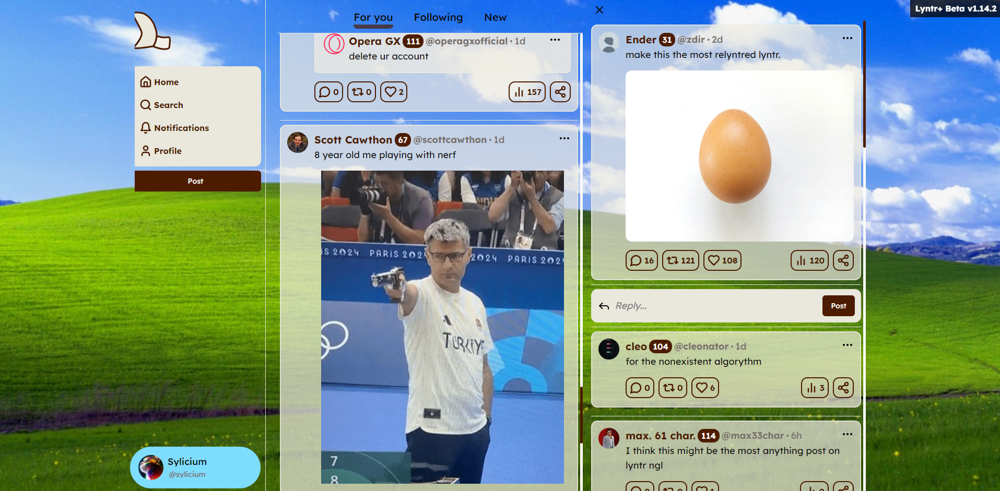

# What is Lyntr+
 Tired of not being able to click @user tags ? You want to customize your Lyntr app ?
 Do not wait more, use Lyntr+ !
 
 Lyntr+ is a easy to use userscript meant to easily change the disign or lyntr, add possibilities and fix bugs quickly !

### Features:
- ✅ Click on @mentionned peoples in lynts
- ✅🆕 Clickable links in lynts
- ✅🆕 Clickable mention and links in biographies
- ✅ Change the background
- ✅ Copy into the clipboard any lynt
- ✅ Change the transparency and the color of lynts
- ✅ Special display for verified peoples
- ✅ Special display for official account
- ✅ Change color of profile button
- ✅ Update script in one click when available in the top right corner !
- ✅ Update script in one click when available in the top right corner !
- ✅ Customize the Lyntr logo
- ✅🆕 Auto scroll top on feed change
- ❌ Make you a coffee

# How to install ?
 1. Get TamperMonkey for [Chrome](https://chromewebstore.google.com/detail/tampermonkey/dhdgffkkebhmkfjojejmpbldmpobfkfo?hl=fr) or [Firefox](https://addons.mozilla.org/fr/firefox/addon/tampermonkey/). Or an alternative like [ViolentMonkey](https://violentmonkey.github.io/)
 2. Click [here](https://github.com/Sylicium/lyntr-plus-userscript/raw/main/production/lyntr-plus.user.js) to download the script or go into the Releases on the right, then tags, and download the last version.

# How to update ?
 1. Click the TamperMonkey icon in your browser
 2. Click on the settings
 3. In the "Last update" column, click on the row of the script to check for new updates
 
# How to customize ?
 1. Click the TamperMonkey icon in your browser
 2. Click on the settings
 3. Click on the Lyntr+ userscript
 4. Scroll down a bit until you see `const _CONFIG`
 5. Everything in that section is your configuration, try to change some settings to true/false or play with the values :D
